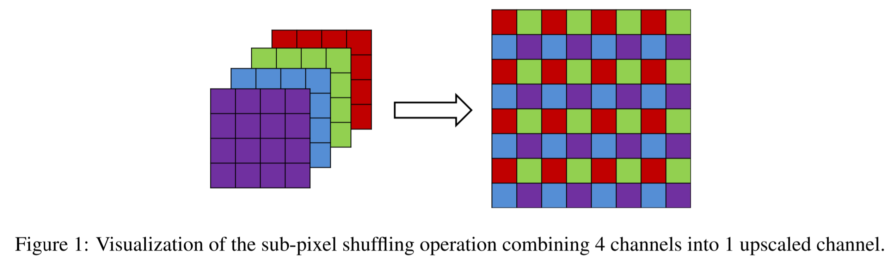
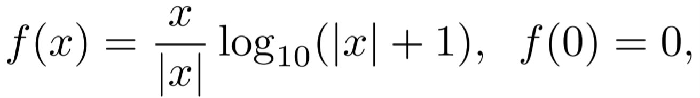
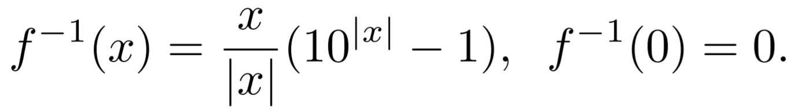
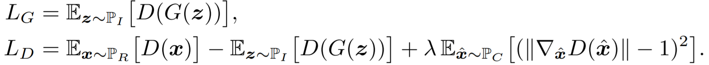
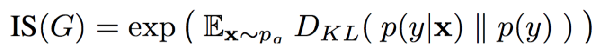
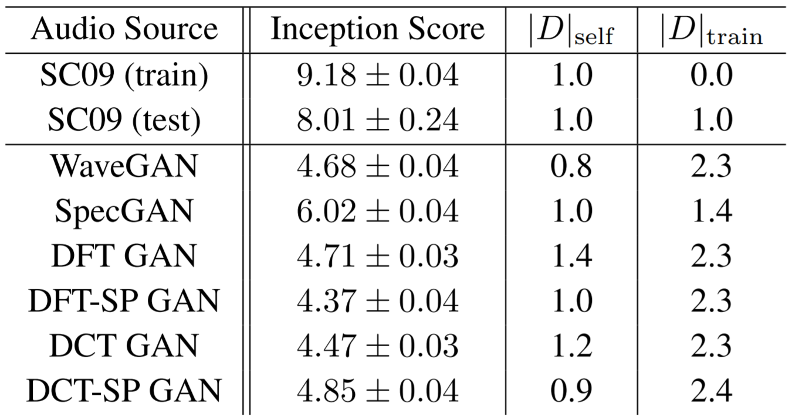
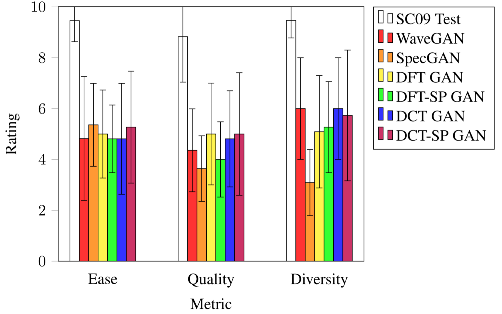

# Audio Synthesis with Generative Adversarial Networks
A team project for CMSC723 at the University of Maryland College Park, fall 2018. 

In this project our team came up with an approach to unsupervised audio synthesis using GANs on invertible image-like audio representations, and demonstrated that our method was competitive with the state-of-the-art raw waveform baseline while requiring less than half the training time. 

For details of our work, please refer to our [project report](report.pdf).

## Introduction
As an attempt to adapt image-generating GANs to audio, Donahue et al. proposed two different approaches to generating fixed-length audio segments based on the DCGAN architecture: [SpecGAN and WaveGAN](wavegan.pdf). SpecGAN operates on image-like 2D magnitude spectrograms of audio, but the process of converting audio into such spectrograms lacks an inverse, as phase information is discarded. WaveGAN instead operates on raw audio waveforms; however, artifacts caused by convolutional operations become more troublesome to mitigate in the audio domain. 

Here we extend the work of Donahue. We only focused on SpecGAN and did not put efforts on WaveGAN as we believed frequency information is more representative of human sound perception. The main improvements we made over SpecGAN are summarized below.

- we use [invertible time-frequency representations of audio](#1-data-scaling-and-normalization), so that the generated audio does not suffer the significant distortion introduced by approximate inversion methods.

- we use sub-pixel convolution instead of transposed convolution to upsample audio, as sub-pixel convolution is less prone to checkerboard artifacts than transpose convolution.

- we use sub-pixel convolution (see figure 1) instead of transposed convolution to up-sample audio, as sub-pixel convolution is less prone to checkerboard artifacts than transpose convolution.

- we experimented with discrete cosine transformation (DCT) in addition to discrete Fourier transformation (DFT). DCT’s outputs are purely real and may be better suited for conventional deep learning architectures.

 

## Methodology
As with SpecGAN, we consider the problem of generating audio clips consisting of 16384 samples at 16 kHz. For that purpose we first transform the audio signal in an invertible manner. This involves using the short-time DFT or DCT to create a time-frequency representation with phase information. A fixed transformation is applied to all input audio data, and its inverse is applied to the generator output to produce audio signals. GAN training then proceeds entirely in the transformed time-frequency domain, using the Wasserstein loss with gradient penalty (see [the Donahue paper](wavegan.pdf)). 

#### 1. Data Scaling and Normalization
The magnitudes of the DFT and DCT outputs are scaled roughly logarithmically both to simulate human auditory perception and to better bound the range of values. To do so without affecting phase information, we use an invertible function that maps 0 to itself:

 
along with its inverse:

 

Further, the magnitudes of the data are rescaled on a per-frequency basis: individually for each frequency, all values are divided by the maximal magnitude across the entire training dataset. Thus, all values are scaled into the range \[−1, 1\], matching the range of the tanh activation function used for the generator. These values are then multiplied by 0.9 to further limit this range, thereby allowing the generator to predict all possible values present in the dataset without saturating its output activations.

#### 2. Network Architecture
We introduce four model configurations, which are the 4 combinations of DFT/DCT with transposed/sub-pixel convolution. We denote them as DFT GAN, DCT GAN, DFT-SP GAN, and DCT-SP GAN. The generator architectures for each of these are shown in Table 1 of our report, and the discriminator architectures in Table 2 of our report.

#### 3. GAN Training
We train all of our models using the Wasserstein loss with gradient penalty (WGAN-GP). In accordance to WGAN-GP, our generator and discriminator losses *LG*, *LD* are:

 

Here, G and D are the functions computed by the generator and discriminator, and λ > 0 is a constant hyperparameter known as the gradient penalty weight. P*I* and P*R* are the latent and data distributions, and P*C* is a distribution comprised of all convex combinations of samples from G(P*I*) and P*R*.

As the above formulation is intractable in practice, during training we compute *LG* and *LD* by approximating P*I*, P*R*, and P*C* with minibatches. For each generator, we use 100 i.i.d. uniform random variables on \[−1, 1\] as P*I*.

## Evaluation
We implement our models in Keras using TensorFlow as the backend, and evaluate our models alongside the best WaveGAN and SpecGAN models presented in the Donahue paper as baselines.

#### 1. Dataset
We choose to evaluate our models on the same dataset used in the Donahue paper: **SC09**. This dataset is comprised of roughly 21000 single-second utterances of spoken digits “zero” through “nine” from a variety of speakers. The recordings were made at 16 kHz under inconsistent recording conditions, and the resulting audio clips are not time-aligned.

#### 2. Training Configuration
For all models, we train both the generator and discriminator with model size d = 64 using Adam with α = 1e−4, β1 = 0.5, β2 = 0.9 on the WGAN-GP losses with gradient penalty weight λ = 10. Using a batch size of 64, we train the discriminator for 5 iterations for every generator update.

On SC09, the training of DFT GAN, DFT-SP GAN, DCT GAN, DCT-SP GAN, and SpecGAN converges within 58000 generator iterations (roughly equivalent to 200 epochs). Using a single NVIDIA P6000 GPU, all of these models finish training within 60 hours.

#### 3. Metrics
We evaluate the audio generated by the models with respect to the same quantitative and qualitative metrics presented in the Donahue paper, as described below.
- **Inception score**
  -  
  - measures both the quality and the cross-class diversity of the generated audios
  - does not penalize overfitting and low within-class diversity
  
- **|*D*|self**
  - measures the average L2 distance of a set of 1K generated examples to their nearest neighbor within the generated set
  - value close to 0 means no within-class diversity (one sound for each class)
  
- **|*D*|train**
  - measures the average L2 distance of a set of 1K generated examples to their nearest neighbor in the real training data
  - value close to 0 means memorization of training data (overfitting)

- **Qualitative ratings**
  - Subjects were asked to assess 10 audio samples generated by each of our four models, with respect to three metrics: sound quality, ease of intelligibility, and speaker diversity
  - As a control, subjects are also asked to rate 10 randomly-selected audio samples from the SC09 test set

## Results
Table 3 shows the quantitative metrics for samples produced by the tested models, along with the training data and test data. None of the tested models seem to heavily overfit or have low diversity, as indicated by |*D*|self and |*D*|train. All four proposed models achieve inception scores around that of the WaveGAN baseline.

 
Table 3: Quantitative results for the SC09 dataset. A high inception score implies that the generative model’s outputs are easily classified. Values for |*D*|train and |*D*|self that are close to 0 are indicative of overfitting and low diversity, respectively.    

The qualitative results are shown in Figure 2. While the small sample size makes it difficult to draw strong conclusions, all four proposed models seem to outperform SpecGAN in speaker diversity and are comparable to WaveGAN with respect to all three qualitative metrics.

 
Figure 2: Qualitative ratings for *ease* of intelligibility, sound *quality*, and speaker *diversity* from 11 subjects. Plotted are the mean ratings for each of the three metrics, alongside the standard error.    

Our proposed models seem to perform at levels comparable to those of WaveGAN in both qualitative and quantitative metrics, whilst converging in much fewer training iterations (200 epochs for ours vs 700 epochs for WaveGAN). This suggests that time-frequency representations may be better suited for learning with standard convolutional GAN architectures compared to raw waveforms.

Authors

[Bowen Zhi](mailto:bowen.zhi1995@gmail.com), [Fan Yang](mailto:fyang623@gmail.com), [Nadee Seneviratne](mailto:nadeeseneviratne@gmail.com), [Patrick Owen](mailto:patowen95@gmail.com)
